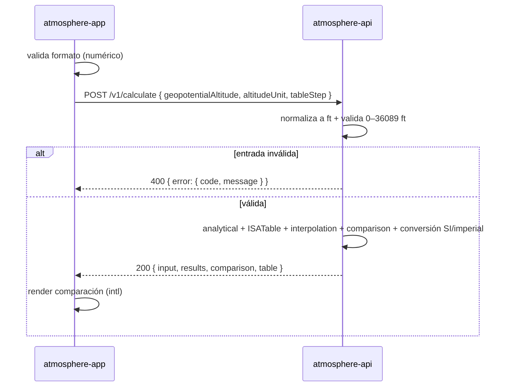

# Calcular y comparar ISA

**Tipo:** Feature
**Status:** Draft
**Creado:** 2026-06-12
**Última actualización:** 2026-06-12
**Stories:** —

## Descripción

Flujo completo de cálculo de los parámetros atmosféricos ISA en la tropósfera. Se dispara
cuando el usuario ingresa una altitud (y opcionalmente el paso de la tabla) y solicita el
cálculo. `atmosphere-api` calcula por método **analítico** e **interpolación**, arma la
**comparación** por magnitud y devuelve cada magnitud absoluta en SI e imperial; el frontend
solo muestra el resultado. Es la única jornada del producto.

## Servicios Involucrados

| Servicio | Rol | Tipo de Participación |
|----------|-----|-----------------------|
| atmosphere-app | Toma la entrada del usuario y envía la solicitud; muestra el resultado | Iniciador / Consumidor |
| atmosphere-api | Normaliza, valida, calcula ambos métodos + comparación, convierte unidades | Procesador |

## Pasos del Flujo



### Paso 1: Usuario envía la solicitud de cálculo

**Origen:** atmosphere-app
**Destino:** atmosphere-api
**Tipo:** REST

**Request:**
- **Método:** POST
- **Endpoint:** `/v1/calculate`
- **Body:**
  ```json
  {
    "geopotentialAltitude": "number — altitud geopotencial, en la unidad de altitudeUnit (req)",
    "altitudeUnit": "string — enum: m | ft (opt, default: ft)",
    "tableStep": "number — paso de la tabla, en altitudeUnit (opt, default: 1000)"
  }
  ```

**Nota:** `atmosphere-app` valida solo el formato (numérico) antes de enviar; la validación de rango es autoritativa en la API (Paso 2).

**Ref:** `docs/apis/atmosphere-api.yaml` → `POST /v1/calculate` (`CalculationRequest`)

---

### Paso 2: Normalización, validación y cálculo

**Origen:** atmosphere-api
**Destino:** (interno)
**Tipo:** Interno

**Acciones:**
1. Normaliza `geopotentialAltitude` y `tableStep` desde `altitudeUnit` a **ft** (`1 ft = 0.3048 m`).
2. Valida `0 ≤ h ≤ 36089 ft`; `tableStep > 0` y `≤ 36089 ft`. Si falla → error (ver Manejo de Errores).
3. Calcula **analytical** con las fórmulas ISA (constantes exactas ISA 1976, `float64`).
4. Genera la `ISATable` (grilla en ft con `step`) y calcula **interpolation** (interpola columnas; deriva ν y a).
5. Calcula la `comparison` por magnitud: `absoluteDifference` y `relativeErrorPct = (interpolation − analytical)/analytical · 100`.
6. Convierte cada magnitud absoluta a **SI e imperial** (`{si, imperial}`); los relativos quedan adimensionales.

**Operación de BD:** ninguna (servicio stateless; la `ISATable` es en memoria).

**Ref:** `docs/adrs/ADR-002-unidad-canonica-ft-salida-dual.md`, `docs/adrs/ADR-005-precision-numerica-isa.md`, `docs/discovery/analisis-dominio.md` (invariantes)

---

### Paso 3: Respuesta al cliente

**Origen:** atmosphere-api
**Destino:** atmosphere-app
**Tipo:** REST (response del Paso 1)

**Response (éxito):**
- **Status:** 200
- **Body:**
  ```json
  {
    "input": {
      "geopotentialAltitude": "{ m: number, ft: number }",
      "altitudeUnit": "string — m | ft",
      "tableStep": "number"
    },
    "results": {
      "analytical": "AtmosphericResult — method + magnitudes {si,imperial} + relativos",
      "interpolation": "AtmosphericResult — misma estructura"
    },
    "comparison": "MagnitudeDifference[] — una por magnitud (11): magnitude, analyticalValue, interpolationValue, absoluteDifference, relativeErrorPct",
    "table": "{ step, minAltitude, maxAltitude, nodeCount }"
  }
  ```
  Cada `AtmosphericResult` trae: `method` (enum: analytical | interpolation); absolutas `temperature`, `pressure`, `density`, `dynamicViscosity`, `kinematicViscosity`, `speedOfSound` (objeto `{si, imperial}`); relativos `theta`, `delta`, `sigma`, `speedOfSoundRatio`, `viscosityRatio` (number).

**Acción del frontend:** renderiza la comparación lado a lado (formato/precisión con `intl`, 5 cifras significativas).

**Ref:** `docs/apis/atmosphere-api.yaml` → `CalculationResponse`

---

## Manejo de Errores

| Paso | Error | Código | Response | Comportamiento |
|------|-------|--------|----------|---------------|
| 1 | Entrada no numérica / vacía | (cliente) | — | `atmosphere-app` bloquea el envío y marca el campo |
| 2 | Altitud fuera de `0–36089 ft` | 400 | `{ "error": { "code": "outOfRange", "message": "…" } }` | La app muestra el mensaje; no hay resultado |
| 2 | Entrada no parseable en la API | 400 | `{ "error": { "code": "invalidInput", "message": "…" } }` | La app muestra el mensaje |
| 2 | `tableStep` ≤ 0 o fuera de rango | 400 | `{ "error": { "code": "invalidStep", "message": "…" } }` | La app muestra el mensaje |
| 1/3 | Sin conectividad con la API | — (red) | — | La app muestra error de conexión (requiere API; no es offline) |

## Resultado

**Éxito:** el usuario ve, para cada magnitud, el valor analítico y el interpolado en SI e
imperial, con su diferencia (`absoluteDifference`) y error relativo (`relativeErrorPct`), más
la altitud de entrada en m y ft. El error en `temperature` es ≈ 0 y aparece error apreciable
en `pressure`/`density` según el `tableStep`.

**Estado final:**
- Ningún cambio persistido (servicio stateless).
- `atmosphere-app` muestra la comparación; `atmosphere-api` no retiene estado.

## Notas

- Es un flujo **síncrono request/response**; no hay eventos ni procesos en segundo plano (los "eventos de dominio" del análisis son lógicos, no transportados).
- En producción, web y API son orígenes distintos detrás del proxy (`ingress-network`) → la API responde con **CORS** habilitado.
- La `ISATable` se genera en memoria por request (o se cachea en el proceso); nunca se persiste.
