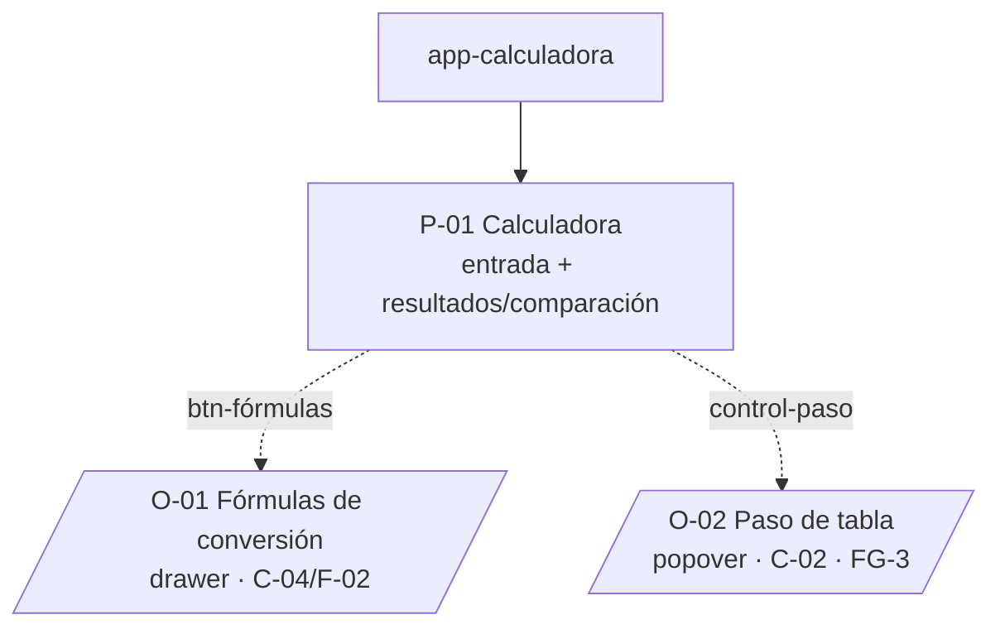

# UX Product Map — app-calculadora

> Inventario estructural de la superficie. Define qué pantallas existen,
> cómo se agrupan y cómo se navega entre ellas. **No define flujos** —
> eso vive en `user-flows.md`. Si el equipo lee esto y no hay objeciones,
> el documento falló: debería generar fricción para provocar decisiones.

**Alcance:** este mapa describe el **producto objetivo** (FG-2 + FG-3): la pantalla de cálculo contempla la comparación analítico-vs-interpolación (FG-3) y el control de paso de tabla (FG-3), aunque FG-2 entregue primero solo el método analítico. El recorte concreto por feature group lo afina un `/product-ux-request` posterior; acá se inventaria la superficie completa para no rediseñar el layout cuando llegue FG-3.

## Audiencias en esta Superficie

- **ingeniero-tecnico** ([research-context](../../audiences/ingeniero-tecnico/research-context.md)) — Ingresa una altitud, lee los parámetros ISA en SI e imperial, contrasta analítico vs. interpolación y consulta las fórmulas de conversión. Audiencia única y primaria (producto mono-usuario, sin roles ni autenticación).

## Inventario de Pantallas

| # | Pantalla | Propósito | Audiencia primaria | Referencia PRD |
|---|----------|-----------|---------------------|----------------|
| P-01 | Calculadora | Entrada de altitud + unidad + paso de tabla, y presentación de resultados ISA: método analítico, interpolación y comparación (Δ + error %), en SI e imperial a la vez | ingeniero-tecnico | C-01, C-02, C-03; F-01; NFR-U01/U02/U03 |

> **Decisión:** una sola pantalla-ruta. El producto es de propósito único (una calculadora); entrada y resultados conviven en P-01 porque el JTBD primario es un ciclo entrada→cálculo→lectura sin saltos de pantalla. No se inventa dashboard, perfil, settings, ni onboarding: el PRD no los requiere (NFR-S01 sin autenticación; sin estado de usuario que configurar). El paso de tabla (C-02) NO es pantalla aparte: es un control dentro de P-01 (ver Overlays / Preguntas Abiertas).

## Inventario de Overlays

| # | Overlay | Tipo | Trigger | Propósito |
|---|---------|------|---------|-----------|
| O-01 | Fórmulas de conversión | drawer (panel lateral) | P-01 · btn-fórmulas (header o barra de acciones) | Referencia estática: por magnitud (altitud m↔ft, T, P, ρ, μ, ν, a) muestra fórmula/factor SI↔imperial; relativos figuran como adimensionales. No calcula. Cubre C-04 / F-02 |
| O-02 | Configuración del paso de tabla | popover (anclado al control de paso) | P-01 · control-paso-tabla | Ajustar `tableStep` (en la unidad activa, default 1.000 ft) y disparar recálculo. Solo afecta al método de interpolación. Cubre C-02. Llega con FG-3 |

> **Decisión sobre "fórmulas" — overlay (drawer), no ruta aparte.** Razones: (1) es contenido estático de **consulta puntual** (C-04/F-02, prioridad Medium), no un destino donde el usuario "trabaja"; (2) el JTBD de verificación ("de dónde salen los números") se ejerce **sin abandonar el contexto** del cálculo que está mirando — un drawer mantiene los resultados a la vista detrás; (3) una ruta aparte introduciría navegación y "vuelta atrás" que no aporta a un producto mono-pantalla. Si una pregunta abierta concluye que las fórmulas se consultan de forma prolongada/comparada contra los resultados, se reevalúa pasarlas a panel persistente (ver Pregunta 3).
>
> **Nota:** O-02 podría no ser overlay sino un campo inline en el bloque de entrada de P-01 (ver Pregunta 1). Se inventaria como popover de forma tentativa porque el paso es un control secundario y exploratorio (hipótesis de comportamiento: se toca pocas veces).

## Estructura de Navegación

### Navegación principal

Superficie mono-pantalla: no hay navegación principal multi-destino. El único destino es **P-01 (Calculadora)**, que es también la pantalla raíz.

### Navegación secundaria

Dentro de **P-01 (Calculadora)**:

- **btn-fórmulas** → abre O-01 (drawer de fórmulas de conversión); cerrar el drawer devuelve a P-01 sin perder el cálculo en curso.
- **control-paso-tabla** → abre O-02 (popover de paso) o se edita inline (a definir, Pregunta 1); el cambio dispara recálculo del método de interpolación. En **FG-2 (REQ-002)** este control está **deshabilitado** (el paso solo aplica a la interpolación, que llega en FG-3); el trigger a O-02 queda inactivo hasta entonces.

> No hay barra de navegación, tabs ni menú: con una sola ruta, agregar cualquiera de esos elementos sería estructura sin contenido.

## Information Architecture

### Agrupación: Cálculo ISA (núcleo)

Pantallas: P-01 (Calculadora). Overlays: O-02 (paso de tabla).

**Por qué se agrupan:** todo el ciclo de trabajo —ingresar altitud/unidad, ajustar paso, calcular y leer resultados/comparación— ocurre en un único contexto. El paso de tabla vive acá (no en una sección de "ajustes") porque su efecto es inmediato sobre el resultado mostrado y la audiencia lo usa de forma exploratoria contra el cálculo a la vista.

### Agrupación: Referencia (consulta)

Overlays: O-01 (fórmulas de conversión).

**Por qué se separa del núcleo:** las fórmulas son contenido estático de consulta, no operación de cálculo. Se las aparta a un overlay para que no compitan por espacio con la entrada y los resultados, pero se las mantiene a un clic desde P-01 porque sirven a la verificación del cálculo que el usuario está mirando.

### Agrupación: Configuración personal / cuenta

Pantallas: (ninguna).

**Por qué:** el PRD no requiere cuentas, perfiles ni preferencias (NFR-S01: sin autenticación; herramienta personal mono-usuario). No se crea sección de configuración. Una eventual preferencia de "unidad por defecto" o "sistema destacado" sería estado local de P-01, no una pantalla.

## Estados Globales

- **Sin conexión / error de API** — Estado de primera clase de la superficie. El cálculo lo resuelve el backend (`atmosphere-api`); sin red el frontend no puede calcular. P-01 conserva la entrada del usuario y muestra el error de conectividad sin descartar lo ingresado, permitiendo reintentar. `[fuente: PRD NFR-PL02; research-context — Restricciones de Contexto]`
- **Error de validación de entrada** — Cuando la altitud está fuera de rango (> 36.089 ft / equivalente en m), no es numérica, o el paso es inválido, la API responde 400 con `error.code` (`outOfRange` | `invalidInput` | `invalidStep`). P-01 muestra el aviso de límite del modelo junto al campo correspondiente y no presenta resultados. `[fuente: PRD C-03; research-context — hipótesis de comportamiento sobre fuera de rango]`
- **Cargando (cálculo en curso)** — Entre el envío y la respuesta, P-01 indica que el cálculo está en proceso (NFR-P01: < 100 ms server-side, pero la latencia de red es variable y no acotada). Afecta solo al bloque de resultados; la entrada sigue editable o se bloquea según se defina. `[fuente: PRD NFR-P01/NFR-PL02; sugerencia fuera de PRD — a validar]`
- **Vacío inicial (sin cálculo aún)** — Al abrir, P-01 no tiene resultados; el bloque de resultados/comparación está vacío hasta el primer cálculo. `[fuente: sugerencia fuera de PRD — a validar]`

> No hay estado "autenticado vs. anónimo": NFR-S01 elimina la autenticación de v1. No hay estado "readonly" ni "rol": audiencia única sin permisos.

## Mapa Visual

## Preguntas Abiertas

1. **¿El control de paso de tabla (C-02) es un campo inline en el bloque de entrada de P-01, o un overlay (popover/panel) que se abre bajo demanda?**
   - Inline en la entrada: el paso ocupa espacio permanente junto a altitud/unidad; refuerza que es parte del request, pero compite con la entrada principal aunque la hipótesis dice que se toca pocas veces. El inventario de overlays pierde O-02.
   - Overlay bajo demanda: P-01 queda más limpia para el caso primario (obtener valores); el paso se revela solo cuando el usuario explora su efecto. Se conserva O-02. Coherente con la hipótesis "cambia el paso pocas veces, de forma exploratoria".

2. **¿La comparación analítico-vs-interpolación (FG-3) se muestra siempre en P-01, o el usuario elige entre vista "solo analítico" y vista "comparación"?**
   - Siempre comparación: P-01 tiene un único layout de tres columnas (analítico | interpolación | Δ/error %) que ya está listo para FG-3 desde el inicio. En FG-2 las columnas de interpolación/error quedan vacías o no se renderizan.
   - Conmutable (modo): P-01 gana un estado/toggle "solo analítico" vs. "comparación", lo que agrega un estado de pantalla y decide qué se ve por defecto al abrir. Afecta el layout y el inventario de estados globales.

3. **¿Las fórmulas de conversión se consultan de forma puntual (un vistazo y cerrar) o de forma prolongada y comparada contra los resultados en pantalla?**
   - Puntual: el drawer O-01 alcanza; se abre, se lee, se cierra sin perder el cálculo.
   - Prolongada/comparada: conviene un panel persistente lado a lado (o sección anclada) en vez de un drawer que tapa parte de P-01; cambiaría O-01 de overlay a bloque dentro de P-01 y reabriría la decisión "overlay vs. ruta".

4. **¿La doble unidad (SI + imperial) se muestra con igual jerarquía, o el imperial es secundario?** (No sabemos si el imperial se usa tanto como el SI — ver research-context "Lo que NO sabemos").
   - Igual jerarquía: cada magnitud ocupa dos celdas equivalentes; el bloque de resultados es más ancho (refuerza el layout desktop-first 1200×800).
   - Imperial secundario: el SI domina y el imperial aparece atenuado o como dato de apoyo; el bloque de resultados es más compacto y cambia el peso visual de la tabla de magnitudes.

5. **¿La superficie debe contemplar layout mobile o se asume estrictamente desktop/web de escritorio?** (El PRD declara desktop-first a 1200×800 y target Web, pero la Web puede abrirse en pantallas chicas).
   - Solo escritorio: el layout de comparación lado a lado (tres columnas) y la doble unidad se diseñan para ancho amplio; no se diseña variante angosta.
   - También pantallas angostas: P-01 necesita una variante donde la comparación pasa de columnas a apilado/scroll, lo que duplica el trabajo de layout del bloque de resultados.

---

**Próximo artefacto:** `user-flows.md` de esta misma superficie define los 3-5 flujos críticos sobre las pantallas inventariadas acá.
